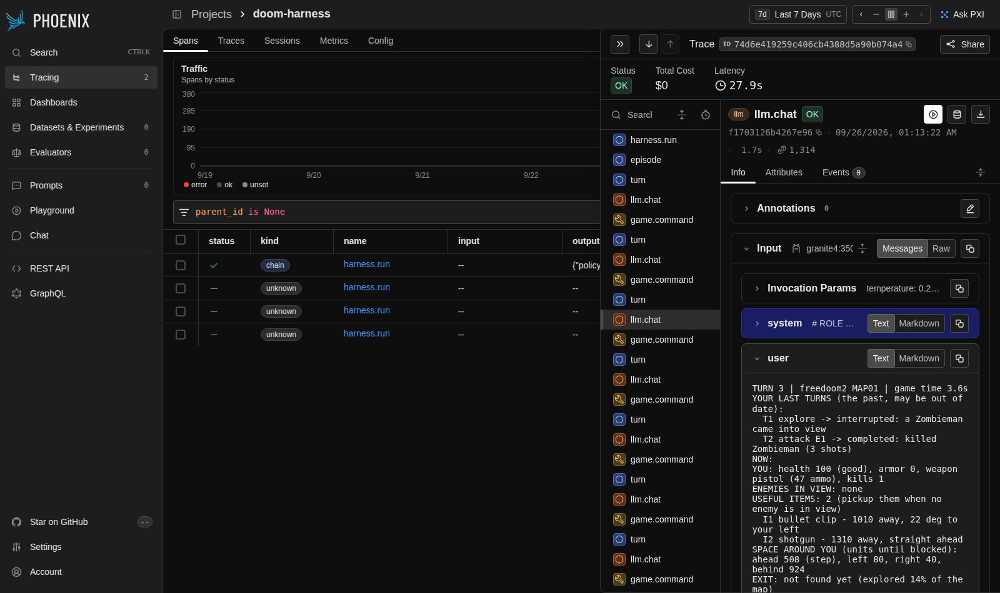

# si-harness-4-doom

**A harness that lets a small local LLM play DOOM.** A 3-billion-parameter model
(IBM Granite 4.2 3B, served by [Ollama](https://ollama.com)) cannot aim or steer
from pixels. It *can* read a short report, follow a written playbook, and pick
the right move. This project builds everything around the model so that is
enough to play:

- a **Doom game server in Docker** with an HTTP API: ViZDoom (the Doom engine
  used for AI research) plus Freedoom, both bundled;
- a **harness**: the instructions, the prompt, the action space, memory and
  guard rails that turn the model's answers into Doom commands;
- a **live viewer** to watch the model play and read its reasoning.


---

## Quick start

Requirements: Docker with Compose v2. About 4 GB of RAM for the model; a GPU is
optional but makes turns much faster.

```bash
git clone https://github.com/ale-sanchez-g/si-harness-4-doom.git
cd si-harness-4-doom
cp .env.example .env          # optional: pick model, scenario, episodes...
docker compose up --build
```

Then open **http://localhost:8000** to watch.

On the first run the harness downloads `granite4.2:3b` (about 2.2 GB) into the
`ollama` volume. Then it plays Freedoom Phase 2 from MAP01, moving on to the next
map whenever it finds the exit (3 episodes by default), and prints every decision:

```
T002 | llm 12.8s | attack E1          | completed: killed Zombieman (3 shots) | hp 100 ar 0 kills 1
       thought: There is 1 enemy in view, so I must attack it according to rule 3.
T003 | llm 13.5s | pickup I1          | interrupted: stopped on the way to the bullet clip: a Zombieman came into view | hp 100 ar 0 kills 1
```

The first decision is slow (the model loads and reads the playbook once); after
that Ollama reuses the cached prompt and each turn only processes a short report.

| You have                   | Run                                                                              |
|----------------------------|----------------------------------------------------------------------------------|
| CPU only                   | `docker compose up --build` (or `make up`)                                       |
| NVIDIA GPU                 | `make gpu` (needs the NVIDIA Container Toolkit)                                  |
| Mac, or Ollama already installed | `ollama pull granite4.2:3b`, then `make host-ollama` (Docker on a Mac cannot use the GPU; native Ollama can) |
| No LLM, just the game      | `make scripted` runs the rule-based baseline                                     |

More `make` targets: `play`, `eval`, `compare`, `report`, `observe`, `bench`,
`check`, `prompt`, `logs`, `down`. Examples: `make play ARGS="--scenario
defend_the_center --episodes 5"`, or set `OLLAMA_MODEL=qwen3:4b` in `.env` to try
another model.

**Model size.** `HARNESS_PRESET` in `.env` picks one of three tested setups:

| Preset | Model             | Size | Playbook  | Per decision (4-core CPU) |
|--------|-------------------|-----:|-----------|--------------------------:|
| `xs`   | `granite4:350m-h` | 340M | `small`   | ~2 s                      |
| `s`    | `granite4:1b-h`   | 1.5B | `small`   | ~7 s                      |
| `m`    | `granite4.2:3b`   | 3.7B | `default` | ~15 s (the default)       |

`make compare` plays the same games with all three and prints a side-by-side table
(see [Comparing models](#comparing-models)).

---

## How it works

```
┌─────────────────────────────── harness (doom_harness) ───────────────────────────────┐
│  observation ──► TurnView ──► situation report ─┐                                     │
│  (JSON)         tags E1/I1,                      ├─► Ollama /api/chat ──► {"Thought",  │
│                 allowed actions                  │   format = JSON schema   "action",  │
│  playbook.md ──► system prompt (cached) ─────────┘   built for this turn     "arg"}    │
│                                                                    │                   │
│  memory + hints ◄── result ◄── POST /api/command ◄── validate/repair ◄─┘ (fallback:    │
│                                                                          scripted rule)│
└─────────────────────────────────────────┬─────────────────────────────────────────────┘
                                          │ HTTP / JSON
┌──────────────────────── doom server (doom_server) ───────────────────────────────────┐
│ ViZDoom (sync mode, frozen between calls) ─ perception ─ nav grid + A* ─ commands     │
│ /api/*  ·  /docs (OpenAPI)  ·  viewer at /  (MJPEG stream, top-down map, agent log)   │
└───────────────────────────────────────────────────────────────────────────────────────┘
```

### 1. Doom becomes turn-based
ViZDoom runs in synchronous mode: the world only moves while a command runs, so
the game waits however long the model thinks, whether 0.5 s on a GPU or 10 s on
a laptop CPU. One turn is one HTTP call.

### 2. The server describes the world in words and numbers
Instead of pixels, every response carries a structured observation:

- **enemies / items / barrels / projectiles** in view, from ViZDoom's object labels.
  Each has a name, distance, bearing (degrees, positive = left) and a short
  description ("imp, throws fireballs"); items also get a walking distance, and
  unreachable ones are marked;
- **walls**: how far you can walk in 8 directions, and what blocks you (wall, door, step);
- **map knowledge**: closed doors (and which key they need), unused switches, and the
  **exit** once seen. These come from the level's WAD line specials;
- **events**: pickups, kills, keys, game messages ("You need a blue key...").

### 3. Actions are intentions, not keypresses
The model picks from about 11 actions: `attack E1`, `pickup I2`, `explore`,
`goto_exit`, `retreat`, `dodge`, `turn`, `move`, `use`, `switch_weapon`, `wait`.
The server executes each one tic by tic:

| Command     | What the server does                                                                 |
|-------------|--------------------------------------------------------------------------------------|
| `attack`    | turns to the target every tic, fires when aimed, picks the best weapon, closes in on far targets |
| `goto`      | shortest path on a navigation grid (door, key and ledge aware), opens doors on the way, unsticks itself |
| `explore`   | walks to the nearest unexplored area (frontier exploration); presses unused switches when nothing is left |
| `goto_exit` | walks to the exit and activates it (switch, walk-over or shootable)                   |

Long commands stop early when something important happens: a **new enemy
appears**, or you take **damage from something unseen**. The model gets to
react, as a human would.

### 4. The playbook: the instructions around the model
`harness/playbooks/default.md` is the model's rulebook: role, goal, an
ordered list of decision rules, facts, the action list, answer format and
examples. The system prompt is built from it once per episode and never changes,
so Ollama keeps it in its KV cache. Each turn only adds a situation report of
about 200 tokens:

```
TURN 9 | freedoom2 MAP01 | game time 9.9s
YOUR LAST TURNS (the past, may be out of date):
  T7 pickup I1 -> completed: picked up the bullet clip
  T8 pickup I1 -> interrupted: stopped on the way to the bullet clip: a Zombieman came into view
NOW:
YOU: health 100, armor 0, weapon pistol (64 ammo), kills 2
ENEMIES IN VIEW: 1 (attack them)
  E1 Zombieman - 800 away, straight ahead - weak zombie with a rifle
USEFUL ITEMS: 2 (pickup them when no enemy is in view)
  I1 bullet clip - 270 away, 13 deg to your right
  I2 shotgun - 400 away, 38 deg to your left
SPACE AROUND YOU (units until blocked): ahead 348, left 32, right 440, behind 252
CLOSED DOOR: 480 away, 144 deg to your right
EXIT: not found yet (explored 25% of the map)
Decide from the NOW part only. Rules in order: DANGER -> dodge | health 30 or less -> ... | otherwise -> explore.
Available actions now: attack, pickup, explore, retreat, dodge, turn, move, use, wait.
What do you do?
```

Everything after `# TURN REMINDER` in the playbook is appended to every report.
Small models pay most attention to the end of the prompt. Scenario-specific notes
live in `harness/playbooks/scenarios/<scenario>.md`.

`harness/playbooks/small.md` is a compact variant for ~1B models: seven actions,
and instead of prose rules to interpret, the harness ends each report with the
answers to the rules' questions (`FACTS: DANGER no | LOW HEALTH no | ENEMIES 1 |
HINT no | ITEMS 2 | EXIT no`). See [Smaller models](#smaller-models).

### 5. Constrained decoding, per turn
The harness sends Ollama a **JSON schema built for this turn**. `action` is an
enum of only the actions possible right now (no `attack` without an enemy, no
`retreat` or `dodge` without a threat), and `arg` is an enum of the current
targets (`E1`, `I2`), directions and owned weapons. Invalid answers cannot be
generated, and the `Thought` is capped at 300 characters so a rambling model
cannot run out of tokens before it answers. The reply is still validated
and repaired (a bad tag falls back to the nearest target), retried once, and
otherwise handled by the scripted baseline.

### 6. Guard rails
Short-term memory shows the model its last turns and adds **HINT** lines when it
is stuck, repeating a failing action, attacking something it cannot hit, or being
hurt by an unseen enemy. Unreachable items are hidden for a while after a failed
pickup. A **loop breaker** catches the typical failure of the smallest models:
after the same action three times in a row with no effect (no movement, damage,
kill or pickup) a HINT says so, and on the fourth time that action is taken off
the menu until the model does something else.

### 7. Observability
- the viewer at `http://localhost:8000` shows the live game, the model's latest
  thought and action, the explored map and the decision log;
- every run writes **local traces** (below), and `make report` summarises them;
- `make observe` adds a **trace UI** (Arize Phoenix) that shows every LLM call.

See [Observability](#observability) for the details.

---

## Tuning the harness

This is the fun part. The playbook is mounted into the container, so edit it and
re-run with no rebuild:

```bash
$EDITOR harness/playbooks/default.md   # or copy it to playbooks/aggressive.md
make prompt                            # print exactly what the model sees
make eval ARGS="--playbook aggressive" # score it on fixed situations, no game needed (~2 min on CPU)
make play ARGS="--playbook aggressive --episodes 5"
make bench                             # LLM vs scripted baseline over several scenarios
```

`eval` replays 11 hand-made situations with a known correct move ("fireball
incoming", "low health and a medikit", "a new zombie right after a kill", "the
exit is known"...) and reports accuracy and latency. It is the quickest way to
see whether a playbook edit or a different model (`--model qwen3:4b`) helps.
See [`harness/playbooks/README.md`](harness/playbooks/README.md) for the
playbook format.

Lessons learned while building this, tested against `granite4.2:3b` and all
encoded in the defaults:

1. **Ollama sorts structured-output keys alphabetically.** A schema asking for
   `{"thought", "action"}` comes back as `{"action", ..., "thought"}`, so the model
   decides *before* it reasons. The reasoning key is therefore `Thought`: a capital
   letter sorts before `action`.
2. **Turn off "thinking" for game loops.** `granite4.2` thinks by default and
   spent 300+ tokens (about 40 s on CPU) per move. The harness sends `think: false`
   to models that support thinking and asks for a one-sentence `Thought` instead.
   Set `HARNESS_THINK=true` on a fast GPU if you want to experiment.
3. **Key the rules to the report's headings**, and put counts next to them:
   "ENEMIES IN VIEW is 1 or more -> attack" plus `ENEMIES IN VIEW: 1 (attack them)`.
4. **Put history first and the present last.** With the last turns printed after
   the current state, the model reasoned "I already killed the zombie" while a new
   one stood in front of it. The report now ends with a `NOW:` block.
5. **Only show fresh news.** A leftover "Zombieman died" event caused the same mistake.
6. **One example per rule.** The model skipped the item rule until the playbook
   had an example of that exact situation.
7. **Describe, don't prescribe.** A monster note saying "sidestep them" made the
   model dodge when the rules said retreat; a hint saying "goto_exit when you are
   ready" made it decide it was not ready yet.

### Results so far

Measured in a 4-core CPU sandbox without a GPU.

**Decision quality** (`make eval`: 11 situations, each asked twice), `granite4.2:3b`:
**21/22 (96%)** rule-correct decisions, median **10 s per decision**. A GPU or
Apple Silicon brings this well under 2 s. For 1B and 340M models, see
[Smaller models](#smaller-models).

**Scripted baseline** (`make bench`, 2 episodes each; the same rules without an LLM),
to show what the server's commands make possible:

| Scenario            | Success | Notes                                              |
|---------------------|---------|----------------------------------------------------|
| `freedoom2` MAP01   | 2/2     | finds the exit in about 40 turns, 9 kills          |
| `basic`             | 2/2     | 2 turns                                            |
| `my_way_home`       | 2/2     | finds the armor in the maze in 9 turns             |
| `deadly_corridor`   | 1/2     | skill 5, as designed                               |
| `defend_the_center` | n/a     | survival scenario: 26 kills before running dry     |
| `defend_the_line`   | n/a     | 32 kills before being overrun                      |
| `health_gathering`  | n/a     | still alive after 150 turns                        |
| `take_cover`        | 0/2     | dodging needs quicker reactions than turn-based play |

**Granite 4.2 3B playing Freedoom MAP01** (one full run, default playbook):
it **reached the exit in 38 turns** with 9 kills and 100 health, taking only 5
damage in the whole level. All 38 decisions came from the model, with no
fallbacks and no repaired answers: 14 attacks, 13 pickups, 5 explores, 4 dodges,
1 turn-around, then `goto_exit`. On the 4-core CPU this took 14 minutes of
wall-clock time, almost all of it spent on the model (median 16.6 s per
decision, while other jobs shared the CPU). A representative moment:

```
T035 | llm 16.6s | dodge right        | ... | hp 95 ar 1 kills 9
       thought: DANGER line indicates a DoomImpBall is flying; I must dodge. HINT says 'dodge left'
                failed twice, so try a different dodge direction.
T036 | llm 16.5s | turn around        | completed: turned left 180 degrees | hp 95 ar 1 kills 9
T037 | llm 15.6s | pickup I1          | completed: picked up the medikit (+25 health) | hp 100 ar 2 kills 9
T038 | llm 14.6s | goto_exit          | episode_over: exit | hp 100 ar 3 kills 9
```

### Smaller models

Granite 4.2 3B is the default because it copes with the full playbook. IBM's
Granite 4.0 Nano models are much smaller and faster, and with the compact
`small` playbook they finish MAP01 as well:

```bash
# .env
HARNESS_PRESET=s        # granite4:1b-h + small playbook; xs = granite4:350m-h
```

| Model             | Parameters | `make eval`, `default` playbook | `make eval`, `small` playbook | Freedoom MAP01, every decision by the model | Per decision in game |
|-------------------|-----------:|--------------------------------:|------------------------------:|---------------------------------------------|---------------------:|
| `granite4.2:3b`   | 3.7B       | **21/22**                       | 21/22                         | exit in 38 turns, 9 kills, 5 damage taken (`default` playbook) | 16.6 s |
| `granite4:1b-h`   | 1.5B       | 11/22                           | **22/22**                     | exit in 30 turns, 8 kills, 5 damage taken   | 7.2 s                |
| `granite4:350m-h` | 340M       | 9/22                            | 18/22                         | exit in 4 of 4 runs (24 to 41 turns), 8-9 kills, 0-4 damage taken | **1.8 s** |

Same 4-core CPU; Q4_K_M weights for the 3B model, Q8_0 for the Nano models. No
fallbacks and no repaired answers in any game. A 340M run takes 75-90 s for the level.
The `small` playbook takes the 1B model from 11 to 22 correct and doubles the 340M
model's score; the 3B model does as well with either.

- **The 1B model plays like the 3B model at about twice the speed.** Its
  `Thought` is a faithful checklist: `DANGER no, LOW HEALTH no, ENEMIES 1 -> attack E1`.
- **The 340M model is four times faster again and finished every run, but it is
  at the edge.** It fails the "low health, retreat" and "follow the HINT" cases,
  and its `Thought` is sometimes copied text rather than reasoning. The harness
  does much of the work: only sensible actions are on the menu and the FACTS
  line does the perception.

What it took, each step checked with `make eval`:

1. **A FACTS line.** The 1B model argued "health 100 is low, retreat" and treated
   any visible enemy as DANGER. The `small` playbook has the harness answer the
   rules' questions (`FACTS: DANGER no | LOW HEALTH no | ENEMIES 1 | HINT no |
   ITEMS 2 | EXIT no`) and the model copies them into its `Thought` up to the
   first matching rule.
2. **Fewer, sensible actions.** Seven instead of eleven, and no `retreat` or
   `dodge` without a threat.
3. **Labels on numbers**, for the small models only: `health 100 (good)`,
   `health 25 (LOW HEALTH!)`. The same label misled the 3B model: at 20 health
   with an imp in view it chose `attack` in 5 of 6 samples ("health is 20 (LOW)
   and enemies are in view, so I must attack"), and `retreat` in 6 of 6 with the
   bare number, which it compares with rule 2's "30 or less". The `default`
   playbook therefore shows the bare number.
4. **Nothing to parrot.** With a one-line rules reminder at the end of each
   report, the 340M model copied the reminder (`ENEMIES 1+ -> attack E1`) instead
   of reading the FACTS line: 15/22 on the eval, and 86 turns to finish MAP01,
   31 of them spent turning around. Without the reminder: 18/22 and 24 turns.
5. **A loop breaker** in the harness. It was essential with the reminder (the
   86-turn run above) and never fired in the four runs without it.

Testing the small models also found a server bug: `explore` next to a closed door
with unexplored space right behind it could "arrive" without moving and loop
forever. It now opens the door first, and gives up on spots it cannot reach.

---

## Observability

Every run is traced, locally, with no extra service. `runs/<timestamp>_<scenario>_<model>/`
holds:

| File              | What is in it                                                                 |
|-------------------|-------------------------------------------------------------------------------|
| `traces.jsonl`    | one span per run, episode, turn, game command and LLM call (see below)         |
| `prompts/`        | each distinct system prompt, stored once and referenced from the traces        |
| `steps.jsonl`     | one line per turn: situation report, raw answer, command, result, tokens       |
| `episodes.json`, `summary.json` | outcome per episode and for the run, including token totals      |

The spans nest `harness.run > episode > turn > llm.chat | game.command`. An `llm.chat`
span has the full request and response and uses the OpenTelemetry GenAI and
OpenInference attribute names:

```json
{"name": "llm.chat", "kind": "client", "duration_ms": 1715.6, "status": "ok",
 "attributes": {"gen_ai.request.model": "granite4:350m-h", "gen_ai.request.temperature": 0.2,
   "gen_ai.request.max_tokens": 200, "gen_ai.usage.input_tokens": 1291, "gen_ai.usage.output_tokens": 36,
   "gen_ai.response.finish_reasons": ["stop"], "llm.tokens_per_second": 45.7,
   "ollama.load_duration_ms": 1.4, "ollama.prompt_eval_duration_ms": 901.8, "ollama.eval_duration_ms": 787.4,
   "harness.allowed_actions": ["attack", "pickup", "explore", "retreat", "dodge", "turn"],
   "harness.action": "attack", "harness.arg": "E1", "...": "..."},
 "payload": {
   "messages": [{"role": "system", "content_ref": "prompts/system_9e403ec6d5f0.md", "chars": 3341},
                {"role": "user", "content": "TURN 2 | freedoom2 MAP01 | game time 2.3s\nYOUR LAST TURNS ..."}],
   "schema": {"...": "the JSON schema enforced on this turn"},
   "options": {"temperature": 0.2, "num_ctx": 8192, "num_predict": 200},
   "response": "{\"Thought\": \"DANGER no, LOW HEALTH no, ENEMIES 1 -> attack E1\", \"action\": \"attack\", \"arg\": \"E1\"}",
   "parsed": {"Thought": "DANGER no, LOW HEALTH no, ENEMIES 1 -> attack E1", "action": "attack", "arg": "E1"}}}
```

A turn that fell back to the scripted policy is marked as an error span, with the reason.
Token counts are Ollama's own (`prompt_eval_count`, `eval_count`).

**Summaries.** `make report` (or `python -m doom_harness report [run dirs]`) prints
outcome, LLM calls, errors, tokens in/out, tokens per call, p50/p95 latency and
tokens per second for the latest run, or side by side for several runs.

**Trace UI.** `make observe` starts the stack plus [Arize Phoenix](https://github.com/Arize-ai/phoenix)
at **http://localhost:6006**, and the harness exports every span to it over
OpenTelemetry (OTLP/HTTP). Phoenix shows each LLM call with its messages, response,
token counts and latency, nested under its turn and episode. To trace one-off
commands, start Phoenix with `make phoenix` and add `OBSERVE=1`
(`make eval OBSERVE=1 ARGS="--preset xs"`), or set `OTEL_EXPORTER_OTLP_ENDPOINT` in
`.env`. Any OTLP-compatible backend (Jaeger, Grafana Tempo, Langfuse...) works the same
way. Outside Docker, install the exporter with `pip install -e "./harness[otel]"`.



### Comparing models

```bash
make pull                                  # download the xs, s and m models once
make compare                               # same map and seed for xs, s and m, then a table
make compare ARGS="--eval"                 # quicker: the 11 eval situations instead of games
make compare ARGS="--models qwen3:4b,granite4.2:3b --playbook default --map MAP02"
make compare OBSERVE=1                     # ...and send every call to Phoenix
```

Each model gets its own run directory, and the table is saved as
`runs/compare_<timestamp>.md`:

| model | playbook | scenario | success | deaths | avg turns | avg kills | fallback | LLM calls | errors | tokens in | tokens out | in/call | out/call | p50 s | p95 s | tok/s |
|---|---|---|---|---|---|---|---|---|---|---|---|---|---|---|---|---|
| granite4:350m-h | small | freedoom2 | 1/1 | 0 | 41 | 9 | 0 | 41 | 0 | 55,086 | 1441 | 1344 | 35 | 1.8 | 2.07 | 49.2 |
| granite4:1b-h | small | freedoom2 | 1/1 | 0 | 35 | 9 | 0 | 35 | 0 | 46,778 | 1470 | 1337 | 42 | 6.7 | 7.42 | 15.2 |
| granite4.2:3b | default | freedoom2 | 1/1 | 0 | 34 | 9 | 0 | 34 | 0 | 54,042 | 1718 | 1589 | 51 | 14.45 | 16.95 | 8.4 |

That is `compare --presets xs,s,m --map MAP01 --episodes 1 --seed 11` on a 4-core CPU:
all three reached the exit; the 340M model needed a few more turns but decided eight
times faster than the 3B one. One episode per model is an anecdote, not a benchmark:
use `--episodes 5` (and several maps) before drawing conclusions.

---

## Scenarios

| Scenario                   | What it is                                                     | Notes                              |
|----------------------------|----------------------------------------------------------------|------------------------------------|
| `freedoom2` (default)      | Freedoom Phase 2 campaign, MAP01-MAP32                         | doors, keys, switches, exit        |
| `freedoom1`                | Freedoom Phase 1 campaign, E1M1-E4M9                           |                                    |
| `doom2` / `doom`           | the original games                                             | put your own `doom2.wad` / `doom.wad` in `./wads` |
| `basic`                    | one monster in front of you                                    | sanity check                       |
| `defend_the_center`        | monsters come from all sides; you cannot move                  | limited ammo                       |
| `defend_the_line`          | hold the line against approaching monsters                     |                                    |
| `deadly_corridor`          | reach the armor at the end of a guarded corridor               | hard                               |
| `health_gathering(_supreme)` | acid floor, survive by collecting medikits                   | no enemies                         |
| `my_way_home`              | find the armor in a maze                                       | navigation                         |
| `take_cover`               | dodge fireballs, no weapon                                     |                                    |

Pick with `HARNESS_SCENARIO` / `HARNESS_MAP` in `.env`, or `--scenario/--map`.
With `HARNESS_CAMPAIGN=true` (the Docker default) an episode that reaches the exit
is followed by the next map; a death restarts `HARNESS_MAP`.

---

## The Doom HTTP API

Anything can play through the API, not just this harness. Interactive docs are
at **http://localhost:8000/docs**.

| Method & path             | Purpose                                                               |
|---------------------------|-----------------------------------------------------------------------|
| `POST /api/episode`       | start an episode `{scenario, map, skill, seed, timeout}` → observation |
| `GET  /api/observation`   | the current observation                                               |
| `POST /api/command`       | run a high-level command → `{status, reason, events, changes, observation}` |
| `GET  /api/commands`      | command catalogue with parameters                                     |
| `POST /api/step`          | low-level: hold raw buttons for N tics (RL-style clients)             |
| `GET  /api/scenarios`     | available scenarios                                                   |
| `GET  /api/frame.jpg`, `/api/map.png`, `/api/stream.mjpg` | current frame, top-down map, live video |
| `GET  /api/status`        | cheap status for dashboards                                           |
| `POST/GET /api/agent/log` | post or read the agent's decisions (shown in the viewer)             |
| `PUT  /api/settings`      | change playback speed at runtime (`playback_fps`, 0 = max)            |

```bash
curl -s -X POST localhost:8000/api/episode -H 'content-type: application/json' \
     -d '{"scenario": "freedoom2", "map": "MAP01"}' | jq .enemies
curl -s -X POST localhost:8000/api/command -H 'content-type: application/json' \
     -d '{"command": "explore", "duration": 5}' | jq '{status, reason, changes}'
curl -s -X POST localhost:8000/api/command -H 'content-type: application/json' \
     -d '{"command": "attack", "target_id": 121}' | jq .reason
```

`status` is one of `completed`, `interrupted` (with the reason, e.g. `a DoomImp came into view`),
`failed` (e.g. `no known path (blocked by a locked door...)`) or `episode_over`.

---

## Configuration

Everything is in `.env` (see `.env.example`). The most useful settings:

| Variable               | Default          | Meaning                                                           |
|------------------------|------------------|-------------------------------------------------------------------|
| `HARNESS_PRESET`       | `m`              | `xs`, `s` or `m`: model + playbook (see [Quick start](#quick-start)) |
| `OLLAMA_MODEL`         | (preset)         | any Ollama chat model; overrides the preset's model               |
| `HARNESS_POLICY`       | `llm`            | `llm` or `scripted` (baseline, no model)                          |
| `HARNESS_PLAYBOOK`     | (preset)         | file in `harness/playbooks/`; `small` for ~1B models              |
| `HARNESS_SCENARIO` / `HARNESS_MAP` | `freedoom2` / `MAP01` | what to play                                       |
| `HARNESS_EPISODES`, `HARNESS_MAX_STEPS` | `3`, `400` | how long to play                                       |
| `HARNESS_CAMPAIGN`     | `true`           | after an exit, continue with the next map                         |
| `HARNESS_REASONING`    | `true`           | ask for a one-sentence `Thought` before each action               |
| `HARNESS_TRACE`        | `true`           | write `runs/<run>/traces.jsonl` (prompts, responses, tokens, timings) |
| `OTEL_EXPORTER_OTLP_ENDPOINT` | (empty)   | also export traces over OTLP/HTTP, e.g. `http://phoenix:6006`     |
| `HARNESS_THINK`        | auto (off)       | Ollama's `think` flag for reasoning models                        |
| `HARNESS_TEMPERATURE`  | `0.2`            | sampling temperature                                              |
| `DOOM_PLAYBACK_FPS`    | `35`             | 35 = watchable real time, 0 = as fast as possible                 |
| `DOOM_SKILL`           | `3`              | 1 (easy) to 5 (nightmare) for campaigns; ViZDoom scenarios keep their own |
| `DOOM_KNOWLEDGE`       | `fair`           | `fair`: the exit is known once seen; `full`: known from the start |
| `DOOM_HEARING_RANGE`   | `0`              | report out-of-sight monsters within this range (0 = off)          |

---

## Running without Docker

```bash
python -m venv .venv && . .venv/bin/activate
pip install -e "./server[dev]" -e "./harness[dev]"
python -m doom_server &                                   # http://localhost:8000
ollama pull granite4.2:3b                                 # native Ollama
python -m doom_harness play --scenario freedoom2 --episodes 1
```

Tests (the server tests drive the real engine headlessly, including a full
MAP01 run to the exit through the API):

```bash
cd server && pytest -q
cd harness && pytest -q
```

## Project layout

```
server/doom_server/   session.py (ViZDoom lifecycle, per-tic tracking), perception.py,
                      commands.py (macro actions), navigation.py (grid, paths,
                      exploration), wad.py (line specials), api.py, static/index.html
harness/doom_harness/ agent.py (turn loop), actions.py (action space + schema),
                      prompts.py, policies.py (LLM + scripted), memory.py, llm.py,
                      evals.py (decision-quality checks), telemetry.py (traces),
                      report.py (run summaries), cli.py
harness/playbooks/    the instructions: default.md, small.md (~1B models), scenarios/*.md
docker-compose*.yml   doom + ollama + harness (GPU / host-Ollama overrides)
```

## Credits and licenses

- [ViZDoom](https://github.com/Farama-Foundation/ViZDoom) (MIT) provides the Doom
  engine and the classic AI scenarios.
- [Freedoom](https://freedoom.github.io) (BSD-3-Clause) provides the free game data
  bundled with ViZDoom. No commercial WADs are included; bring your own for `doom`/`doom2`.
- [IBM Granite 4.2](https://ollama.com/library/granite4.2) (Apache 2.0) is the default model;
  the [Granite 4.0](https://ollama.com/library/granite4) Nano models (Apache 2.0) were used for the small-model tests.
- This project: MIT, see `LICENSE`.
